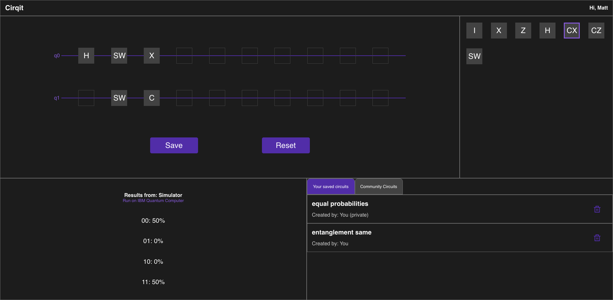

# Quantum Circuit Simulator

## How to Use

Select a quantum logic gate on the right and click on any open space in the circuit to place it. To place control gates, click the open space on the qubit you want to be the control. To delete a gate, click on it. Click "Reset" to quickly clear the entire circuit.\
Every time you change the circuit, the results will automatically update.

Press "Run on IBM Quantum Computer" to run the circuit you created on a real IBM quantum computer and have those results displayed instead of the simulated results. It does work, but most of the time, it can take up to 30 minutes because the queues can get very long. Make sure not to change the circuit to anything else while waiting for the results.

Press "Sign In" in the upper right corner to sign in using your Google account. This will allow you to save your circuits, either privately or publicly. Any publicly saved circuits will be viewable in the "Community Circuits" tab, even if not signed in to an account.

## How to Run

-Clone the Project\
-Run npm start in root directory and server directory

## Extra Info

Made with React, Express, and Firebase in two weeks as final project of Concordia University web development bootcamp. Watch my presentation

In case you don't want to blindly trust my math, you can verify it by creating the same circuits on [IBM Quantum Composer](https://quantum-computing.ibm.com/composer/)
